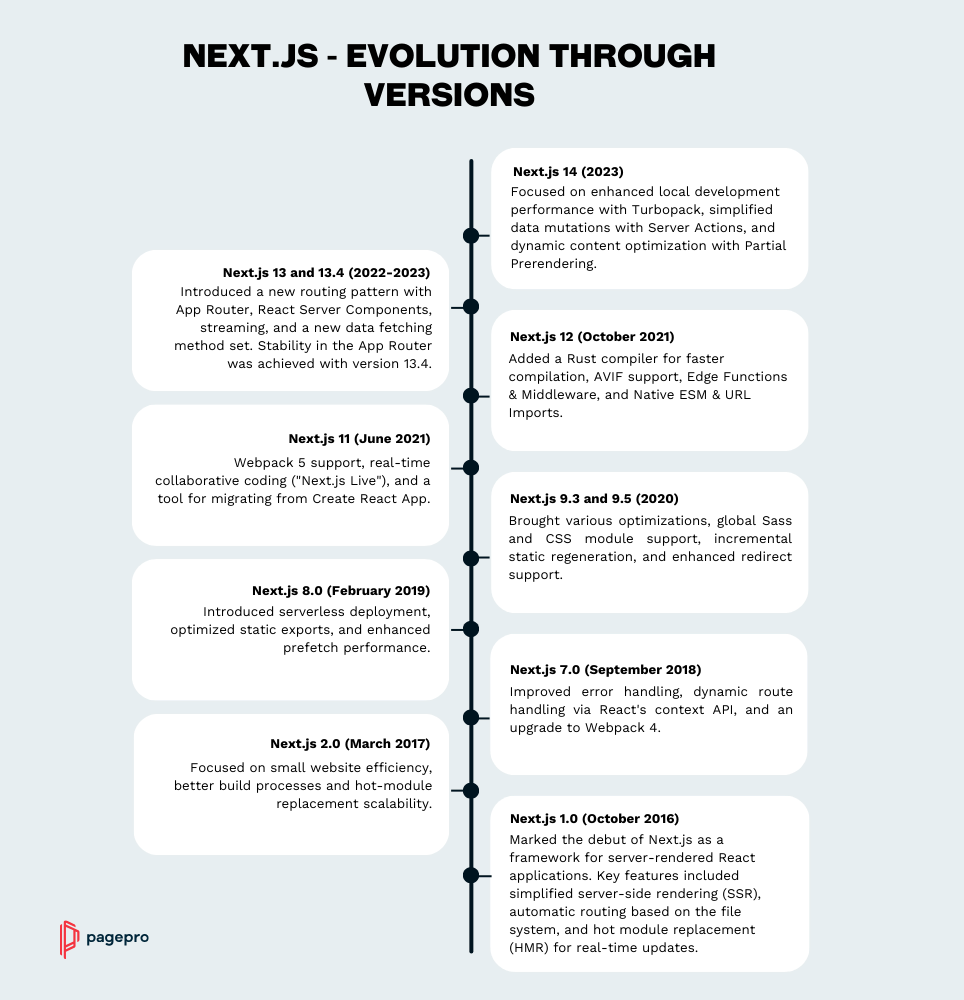

# Introduction

Next.js is a full-stack [React](https://react.dev/learn) Single Page Application framework. It’s versatile and lets you create React apps of any size—from a mostly static blog to a complex dynamic application. To create a new Next.js project, run in your terminal:

```bash filename="Terminal" {3} copy
npx create-next-app@latest
```

[Next.js](https://github.com/vercel/next.js) is maintained by [Vercel](https://vercel.com/). You can deploy a Next.js app to any Node.js or serverless hosting, or to your own server. Next.js also supports a static export which doesn’t require a server.

## The History Of Next



## Main Features

| Feature         | Description                                                                                                                                                                                      |
| --------------- | ------------------------------------------------------------------------------------------------------------------------------------------------------------------------------------------------ |
| `Routing`       | A file-system based router built on top of Server Components that supports layouts, nested routing, loading states, error handling, and more.                                                    |
| `Rendering`     | Client-side and Server-side Rendering with Client and Server Components. Further optimized with Static and Dynamic Rendering on the server with Next.js. Streaming on Edge and Node.js runtimes. |
| `Data Fetching` | Simplified data fetching with async/await in Server Components, and an extended fetch API for request memoization, data caching and revalidation.                                                |
| `Styling`       | Support for your preferred styling methods, including CSS Modules, Tailwind CSS, and CSS-in-JS                                                                                                   |
| `Optimizations` | Image, Fonts, and Script Optimizations to improve your application's Core Web Vitals and User Experience.                                                                                        |
| `TypeScript`    | Improved support for TypeScript, with better type checking and more efficient compilation, as well as custom TypeScript Plugin and type checker.                                                 |
