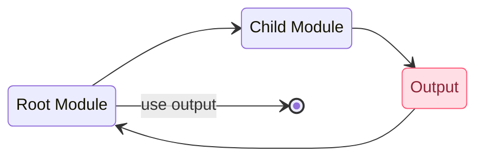

import { FileTree } from 'nextra/components'

# Module Outputs

## Passing Values from Child Module
The resources defined in a module are encapsulated, so the calling module cannot access their attributes directly. However, the child module can declare output values to selectively export certain values to be accessed by the calling module.   

For example, the following files are part of the child module called "cps". Observe there are 2 output values: `dns_challenges` and `enrollment_id`. 

```hcl filename="./modules/cps/variables.tf" copy
variable "contract" {}
variable "common_name" {}
```

```hcl filename="./modules/cps/main.tf" copy {}
resource "akamai_cps_dv_enrollment" "my_enrollment" {
  contract_id = var.contract
  common_name = var.common_name
  # ... other configuration ...
}
```

```hcl filename="./modules/cps/outputs.tf" copy {}
output "dns_challenges" {
  value = akamai_cps_dv_enrollment.my_enrollment.dns_challenges
}

output "enrollment_id" {
  value = akamai_cps_dv_enrollment.my_enrollment.id
}
```

## Referencing Outputs from Child Module
The syntax is as follows:

```hcl
module.module_name.output_name
```

Following our previous example for the `dns_challenges` and `enrollment_id` outputs and assuming our CPS modue name is `cert_enrollment`, we can read these values from the parent module like so:
```hcl
module.cert_enrollment.dns_challenges

module.cert_enrollment.enrollment_id
```

The outputs are values that the module returns for other parts of your code to use. In the example above the certificate enrollment ID can be used in the `akamai_edge_hostname` resource outside of the module, and the DNS Challenges for the certificate domain validation can be used to update Edge DNS records in a different module:

```hcl filename="main.tf" copy {14,20}
module "cert_enrollment" {
  source = "./modules/cps"  # Path to module
  contract   = "C-0N7RAC7"
  common_name = "www.example.com"
  # ... other configuration ...
}

resource "akamai_edge_hostname" "my_edge_hostname" {
  product_id    = "Fresca"
  contract_id   = "C-0N7RAC7"
  group_id      = "12345"
  ip_behavior   = "IPV4"
  edge_hostname = "example.com.edgekey.net"
  certificate   = module.cert_enrollment.enrollment_id 
}

module "akamai_edgedns" {
  source                = "./modules/dns"
  dns_zone              = "example.com"
  challenge_records     = module.cert_enrollment.dns_challenges
}
```

1. In the first block (`module`) the certificate enrollment is created by calling the `./modules/cps` module. Remember that this module outputs `dns_challenges` and `enrollment_id`.
2. The `akamai_edge_hostname` resource reads the `cert_enrollment` output for `enrollment_id`, and uses it for the `certificate` argument as the value.
3. The `akamai_edgedns` module reads the `cert_enrollment` output for `dns_challenges`, and uses it for the `cert_enrollment` argument as the value.


