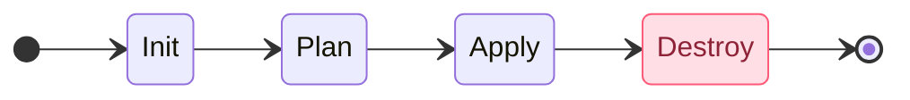

# 2. Terraform Core Workflow

The core Terraform workflow consists of four main steps after you have written your Terraform configuration:

| Command         | Description                                                                                                                                                                                      |
| --------------- | ------------------------------------------------------------------------------------------------------------------------------------------------------------------------------------------------ |
| 1. `init`       | Initialize prepares your project so Terraform can apply your configuration. When you initialize, Terraform configures the backend, installs all providers and modules referred to in your configuration, and creates a version lock file if one doesn't already exist.                                                    |
| 2. `plan`     | Plan allows you to preview the changes Terraform will make before you apply them. creates a plan consisting of a set of changes that will make your resources match your configuration. Terraform plan does not make any changes to your resources, you must apply a plan for Terraform to make changes. |
| 3. `apply` | Terraform uses the providers and modules installed during initialization to execute the steps stored in an execution plan. These steps create, update, and delete infrastructure to match your resource configuration.                                                |
| 4. `destroy` | Terraform inspects its state file for resources it has created, then systematically deletes all of them in sequence. This is typically used to tear down temporary environments or upon project completion |

You will run the above workflow multiple times during this workshop. Pay close attention to the `terraform plan` output.