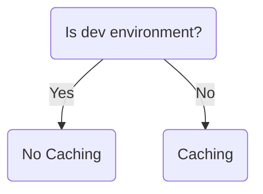
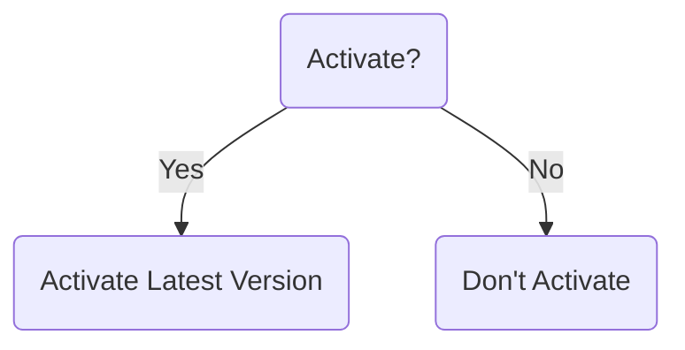

# Conditional Expressions

A conditional expression uses the value of a boolean expression to select one of two values. 
If you are familiar with programming languages such as Javascript or Python the Terraform conditional expressions are similar if-else functions. 

The syntax of a conditional expression is as follows:
```hcl copy
condition ? true_val : false_val
```
If `condition` is `true` then the result is `true_val`. If `condition` is `false` then the result is `false_val`.

## Example \#1
In a property rule tree you can set behaviors based on a condition. For example we could apply a caching "no store" when `var.environment` is "dev":

```hcl filename="rules.tf" copy {8}
data "akamai_property_rules_builder" "my_property_rule_caching" {
  rules_v2024_02_12 {
    name                  = "Caching"
    comments              = "Offload Origin"
    criteria_must_satisfy = "any"
    behavior {
      caching {
        behavior        = var.environment == "dev" ? "NO_STORE" : "MAX_AGE"
        must_revalidate = false
        ttl             = "7d"
      }
    }
  }
}
```
In this scenario when `behavior = "NO_STORE"` the other arguments for the `caching` behavior block are ignored. And if the environment is other than dev `behavior = "MAX_AGE"` gets applied instead.



## Example \#2
Another common use of conditional expressions in Akamai is for individual or simoultaneous activations in Property Manager:

```hcl filename="main.tf" copy {4, 13}
resource "akamai_property_activation" "my_property_activation_staging" {
  property_id                    = akamai_property.my_property.id
  contact                        = [var.email]
  version                        = var.activate_property_on_staging ? akamai_property.my_property.latest_version : akamai_property.my_property.staging_version
  network                        = "STAGING"
  note                           = var.version_notes
  auto_acknowledge_rule_warnings = true
}

resource "akamai_property_activation" "my_property_activation_production" {
  property_id                    = akamai_property.my_property.id
  contact                        = [var.email]
  version                        = var.activate_property_on_staging ? akamai_property.my_property.latest_version : akamai_property.my_property.staging_version
  network                        = "PRODUCTION"
  note                           = var.version_notes
  auto_acknowledge_rule_warnings = true
}
```
The logic is similar for both activation resources, but let's review the case for the `my_property_activation_staging` resource:

* If `var.activate_property_on_staging` is `true` then the result is `akamai_property.my_property.latest_version` which holds the latest property version created by the `akamai_property` resource effectively activting the new version to staging. 
* If `var.activate_property_on_staging` is `false` then the result is `akamai_property.my_property.staging_version` which holds the current active version in staging, tricking TF into activate an already activated version effectivelly performing no activation. 



---

## Exercise

import ExerciseConditionals from "../../exercises/8b-ex-conditionals.mdx"

<ExerciseConditionals />
